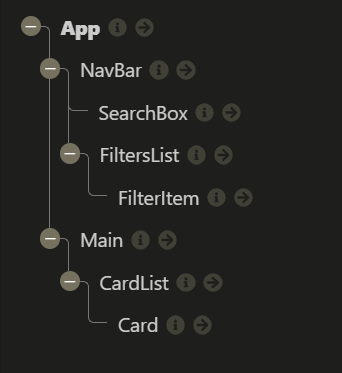

# Feedback

Right click on the file and click Open Preview or `ctrl/cmd + shift + v` to open preview

## Goals

1. Working beers web app - done
2. Practice using API and React - done
3. Application of what you're learning (React, Fetch etc.) - done

## Specification

### Start

> "All the wire frame content in black is the first part of the challenge - that is, the nav, the main section containing the beers and beer cards for each piece of data."



Your component tree looks great you have matched the wire frame & component tree from the brief.

When you are building things in React have a go at breaking your project into a component tree before you go in with the code. It will help you out manage all of the moving pieces.

Thanks for sharing the sapling extension it is a gamer changer.

### Extension 1

> "Once you've got the design and layout sorted to render the elements, it's time to add some search functionality. Make it so you can search the beers by their name, and the page content should update as you type each letter in the box."

The aim of this extension is to get you using functions as props. You have smashed it, the function in your app is being passed multiple component levels to your search component. That component is using the function to capture the user input. This is all triggering your beers to be filtered by the search term.

I would rename element to event or e this is just common practice. Element makes it sound like it is getting a element rather then a event.

```js
// 20 - App.jsx
const handleSearchInput = element => setSearchTerm(element.target.value);
```

### Extension 2

> Finally attempt to make it so you can filter the content on three conditions:
>
> > - High Alcohol (ABV value greater than 6%)
> > - Classic Range (Was first brewed before 2010)
> > - High Acidity (pH lower than 4)
> > - If you can’t achieve this after a good attempt, then feel free to move on to the final extension.

At the moment in your `handleCheckedBoxes()` you are accidentally updating the state. This is to do with how objects and array's are stored in JS. You are copying the array but not copying the objects.

It is hard to explain but I will give it a go.

- If you comment out the `setBeerFilters()` and then add a `console.log(beerFilters);` above the `setBeerFilters()`.
- Then check a box and go to the console.
- You will see the state has been updated.
- In the image below I have done the above and clicked it on and off. You can see the state is being changed.


This is because "..." will only copy the array it will not copy the objects inside. The objects are still the same ones you have defined in state. So when you update then you are updating the state by accident this can lead to problems. To stop this you need to copy the array and the objects inside it.

```jsx
const handleCheckedBoxes = (beerFilter, active) => {
  const beerFiltersCopy = beerFilters.map(beer => ({ ...beer }));
  const index = beerFiltersCopy.findIndex(beerFilterCopy => beerFilterCopy.value === beerFilter.value);
  beerFiltersCopy[index].active = active;
  setBeerFilters(beerFiltersCopy);
};
```

Everything else looks great and kudo's for adding all of the other filters.

Using the beer filters to generate the checkbox components is great. It is a good way to create modular components that only need data to be created. I have refactored you filter chain at the end.

### Extension 3

> Style the website however you see fit! Go wild!

It looks great, I can imagine this being a drinks ordering app for any pub / bar. Super clear and nicely branded.

I think you just need to tweak some of the mobile styles as the nav just vanishes meaning on mobile you can't do anything.

## Overall

Very well componentised code across the board.

Smart variable naming, code was easy to follow. As I said earlier very modular which is React good going!

You have multiple functions being passed across your application. I feel confident with your understanding of useState, useEffect and funcs as props. 

Awesome mate good going!

Keep it up, what are you going to build next?

## To work on

 - Update your readme.md.

### That giant chain of filters.....

```jsx
// 53 - 60 App.jsx
//@Charlie - would love thoughts on how to make this prettier!
const filteredBeers = beers
  .filter(beer => beer.name.toLowerCase().includes(searchTerm.toLowerCase()))
  .filter(beer => (activeFilters.includes("abv") ? beer.abv > 6 : beer))
  .filter(beer => (activeFilters.includes("classic") ? beer.first_brewed.slice(-4) < 2010 : beer))
  .filter(beer => (activeFilters.includes("acidic") ? beer.ph < 4 : beer))
  .filter(beer => (activeFilters.includes("IBU") ? beer.ibu > 90 : beer))
  .filter(beer => (activeFilters.includes("smoke") ? beer.description.includes("smok") : beer))
  .filter(beer =>
    activeFilters.includes("cheese") ? beer.food_pairing.find(element => element.includes("cheese ")) : beer
  )
  .filter(beer =>
    activeFilters.includes("chocolate") ? beer.food_pairing.find(element => element.includes("chocolate ")) : beer
  )
  .map(beer => <Card key={beer.id} beer={beer} />);
```

I took the callback functions you were passing to the filter methods and put them on your beerFilters array of objects. Each object has a filterBy method on it.

```jsx
// App.jsx
const [beerFilters, setBeerFilters] = useState([
  { filterName: "High ABV (> 6.0%)", value: "abv", active: false, filterBy: beer => beer.abv > 6 },
  {
    filterName: "Classic Range",
    value: "classic",
    active: false,
    filterBy: beer => beer.first_brewed.slice(-4) < 2010,
  },
  { filterName: "Acidic (pH < 4)", value: "acidic", active: false, filterBy: beer => beer.ph < 4 },
  { filterName: "Bitter (IBU > 100)", value: "IBU", active: false, filterBy: beer => beer.ibu > 90 },
  { filterName: "Smokey", value: "smoke", active: false, filterBy: beer => beer.description.includes("smok") },
  {
    filterName: "Nice With Something Cheesy",
    value: "cheese",
    active: false,
    filterBy: beer => beer.food_pairing.find(element => element.includes("cheese ")),
  },
  {
    filterName: "Nice With Something Chocolatey",
    value: "chocolate",
    active: false,
    filterBy: beer => beer.food_pairing.find(element => element.includes("chocolate ")),
  },
]);
```

I moved the logic from the `<CardList/>` up a level. At the moment it is doing a lot of logic, to make it reusable I have made it just map over the array it gets. It doesn't have to worry about filtering etc..

```jsx
// CardList.jsx
const CardList = props => {
  const { beers } = props;

  const cardJSX = beers.map(beer => <Card key={beer.id} beer={beer} />);

  return <section className="card-list">{cardJSX}</section>;
};

export default CardList;
```

The logic is now in main.

- It filters by the search term.
- Gets the active beer filters.
- Then goes through the filters and uses the method on the object to filter the array.
- Then gives it to the `<CardList/>` to display.

```jsx
// Main.jsx
const Main = props => {
  const { beers, searchTerm, beerFilters } = props;

  const filteredBySearchTerm = beers.filter(beer => beer.name.toLowerCase().includes(searchTerm.toLowerCase()));

  const activeFilters = beerFilters.filter(filter => filter.active);

  const reducedBeers = activeFilters.reduce(
    (beersToFilter, activeFilter) => beersToFilter.filter(activeFilter.filterBy),
    filteredBySearchTerm
  );

  return <CardList beers={reducedBeers} />;
};
```

It was a big one, let me know if you want to talk through it at any point.
